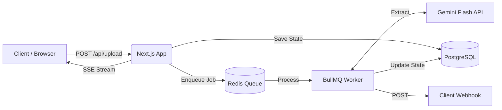

<div align="center">
  
  <h1>OmniFlow</h1>
  <p><strong>The Developer-First Document Intelligence Platform</strong></p>
  
  [](#)
  [](#)
  [](#)
  [](https://opensource.org/licenses/MIT)
</div>

---

**OmniFlow** is an enterprise-grade document intelligence API. Upload any document (PDF, DOCX, TXT, CSV) and OmniFlow uses Google Gemini AI to extract strictly typed, structured data — returned as clean JSON via an asynchronous job queue. 

Designed for scale, OmniFlow features real-time SSE streaming, outbound webhooks, dynamic Zod schemas, and a lightweight Node.js SDK.

---

## ✨ Features

- 🧠 **AI Extraction Engine**: Powered by Google Gemini 3.6 Flash for high-accuracy parsing.
- 📐 **Dynamic Zod Schemas**: Define your own custom JSON extraction schemas per-request.
- ⚡ **Real-Time Pipeline**: Server-Sent Events (SSE) stream job states instantly to the dashboard.
- 🪝 **Outbound Webhooks**: Automatically push extraction results to your own servers.
- 📦 **Native SDK**: Built-in `@omniflow/sdk` for seamless Node.js/TypeScript integration.
- 🏢 **Enterprise Auth**: O(1) SHA-256 API Key hashing and secure session management.
- 💳 **Monetization & Billing**: Integrated Razorpay checkout for a credit-based usage model.
- 🗄️ **Scale Ready**: Backed by PostgreSQL and Redis (BullMQ).

---

## 🏗️ Architecture



---

## 💻 Quick Start

### 1. The NPM SDK
The fastest way to integrate OmniFlow into your application is using our official SDK.

```bash
npm install @omniflow/sdk
```

```typescript
import { OmniFlowClient } from '@omniflow/sdk';

const client = new OmniFlowClient({ apiKey: 'omni_your_api_key' });

// Extract with a custom schema and webhook
const job = await client.extract({
  file: myDocumentBuffer,
  filename: 'invoice.pdf',
  webhookUrl: 'https://my-app.com/webhooks/omniflow',
  extractionSchema: {
    type: 'object',
    properties: {
      totalAmount: { type: 'number' },
      merchantName: { type: 'string' }
    }
  }
});

console.log('Job queued:', job.jobId);
```

### 2. Self-Hosting / Local Development

**Prerequisites**:
- Node.js 20+
- PostgreSQL database
- Redis server (`redis://localhost:6379`)
- Google Gemini API key

**Setup**:
```bash
git clone https://github.com/vansh82674/omniflow.git
cd omniflow
npm install
cp .env.example .env
```

**Database Initialization**:
```bash
npx prisma migrate dev --name init
npx tsx prisma/seed.ts
```
*(This seeds a default admin user: `admin@omniflow.dev` / `omniflow2026`)*

**Run the Platform**:
You need two processes running simultaneously.
```bash
# Terminal 1: Web App & Dashboard
npm run dev

# Terminal 2: Extraction Worker Engine
npm run worker
```

**Docker / Infrastructure**:
We provide a `docker-compose.yml` to instantly spin up PostgreSQL and Redis locally:
```bash
docker-compose up -d
```

**Razorpay (Test Mode)**:
To test billing and the credit system, ensure you set your Razorpay test keys in the `.env` file:
```env
NEXT_PUBLIC_RAZORPAY_KEY_ID=rzp_test_...
RAZORPAY_KEY_SECRET=...
RAZORPAY_WEBHOOK_SECRET=...
```

---

## 📚 Developer Portal & API Docs

OmniFlow provides full interactive OpenAPI documentation. 

Once running locally, navigate to `http://localhost:3000/docs` to view the **Swagger UI**. You can generate API Keys in your dashboard and test the REST endpoints directly from the browser.

---

## 🛠️ Tech Stack

- **Frontend**: Next.js 15 (App Router), TailwindCSS v4, Framer Motion, shadcn/ui.
- **Backend API**: Next.js Route Handlers, Server-Sent Events (SSE).
- **Worker/Queue**: Node.js, BullMQ, Redis.
- **Database**: PostgreSQL via Prisma (`pg` adapter).
- **Authentication**: NextAuth.js (v5), Custom SHA-256 API Key hashing.

---

## 📄 License

This project is licensed under the MIT License.
